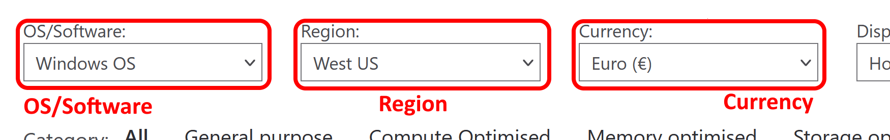
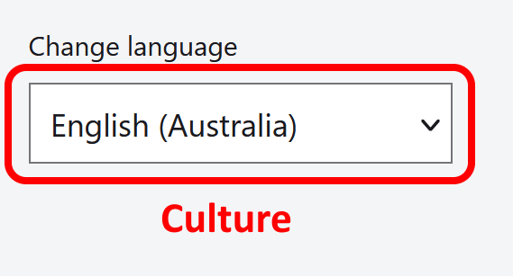

# Azure VM pricing

Mass-pricing of `VMs` on `Azure` based on `CPU` cores count and memory. This is useful when costing a lift-and-shift migration dealing with many thousands `VMS` of varied sizes.

The pricing is retrieved from [Virtual Machines Pricing][virtual-machines-pricing].

:rotating_light: This tool will only provide you with an **estimation**. Depending on your `Azure` spends you might be able to get a better deal from `Microsoft`. You should use the output of this tool as a coarse-grain estimation. On top of the `VM` price you will also need to consider [storage][managed-disks-pricing] and [egress][bandwidth-pricing-details] costs.

This tool is composed of two components:

1. A [Parser](#parser) retrieving the pricing from [Virtual Machines Pricing][virtual-machines-pricing]
2. A [Coster](#coster) using the output from the `Parser` and a list of `VM` specifications to determine their price

This approach allows to decouple pricing acquisition from its usage and open the door to automation. The `Parser` can be scheduled to retrieve the pricing at regular interval and the `Coster` can then use an always up-to-date pricing.

[![Build Status][github-actions-parser-shield]][github-actions-parser]

[![Build Status][github-actions-coster-shield]][github-actions-coster]

## Parser

Retrieve `VMs` **hourly pricing** for a specific combination of **culture**, **currency**, **operating system** and **region**.

| Culture | Culture display name | Currency | Currency display name | Support |
| - | - | - | - | - |
| `en-us` | `English (US)` | `usd` | `US Dollar ($)` | :white_check_mark: |
| `cs-cz` | `Čeština` | `eur`[[1]](#closest-currency-1) | `Euro (€)` | :white_check_mark: |
| `da-dk` | `Dansk` | `dkk` | `Danish Krone (kr)` | :white_check_mark: |
| `de-de` | `Deutsch` | `eur` | `Euro (€)` | :white_check_mark: |
| | | `chf`[[9]](#closest-culture-9)  | `Swiss Franc. (chf)` | :white_check_mark: |
| `en-au` | `English (Australia)` | `aud` | `Australian Dollar ($)` | :white_check_mark: |
| `en-ca` | `English (Canada)` | `cad` | `Canadian Dollar ($)` | :white_check_mark: |
| `en-in` | `English (India)` | `inr` | `Indian Rupee (₹)` | :white_check_mark: |
| `en-gb` | `English (UK)` | `gpb` | `British Pound (£)` | :white_check_mark: |
| | | `nzd`[[7]](#closest-culture-7) | `New Zealand Dollar ($)` | :white_check_mark: |
| `es-es` | `Español` | `eur` | `Euro (€)` | :white_check_mark: |
| `es-mx` | `Español (MX)` | `usd`[[3]](#closest-currency-3) | `US Dollar ($)` | :white_check_mark: |
| `fr-fr` | `Français` | `eur` | `Euro (€)` | :white_check_mark: |
| | | `chf`[[9]](#closest-culture-9)  | `Swiss Franc. (chf)` | :white_check_mark: |
| `fr-ca` | `Français (Canada)` | `cad` | `Canadian Dollar ($)` | :white_check_mark: |
| `it-it` | `Italiano` | `eur` | `Euro (€)` | :white_check_mark: |
| | | `chf`[[9]](#closest-culture-9) | `Swiss Franc. (chf)` | :white_check_mark: |
| `hu-hu` | `Magyar` | `eur`[[1]](#closest-currency-1) | `Euro (€)` | :white_check_mark: |
| `nb-no` | `Norsk` | `nk` | `Norwegian Krone (kr)` | :white_check_mark: |
| `nl-nl` | `Nederlands` | `eur` | `Euro (€)` | :white_check_mark: |
| `pl-pl` | `Polski` | `eur`[[1]](#closest-currency-1) | `Euro (€)` | :white_check_mark: |
| `pt-br` | `Português (Brasil)` | `brl` | `Brazilian Real (R$)` | :white_check_mark: |
| `pt-pt` | `Português` | `eur` | `Euro (€)` | :white_check_mark: |
| `sv-se` | `Svenska` | `sek` | `Swedish Krona (kr)` | :white_check_mark: |
| `tr-tr` | `Türkçe` | `usd`[[3]](#closest-currency-3) | `US Dollar ($)` | :white_check_mark: |
| `ru-ru` | `Pусский` | `rub` | `Russian Ruble (руб)` | :white_check_mark: |
| `ja-jp` | `日本語` | `jpy` | `Japanese Yen (¥)` | :white_check_mark: |
| `ko-kr` | `한국어` | `krw` | `Korean Won (₩)` | :white_check_mark: |
| `zh-cn` | `中文(简体)` | `N/A` | `N/A` | `N/A` |
| `zh-tw` | `中文(繁體)` | `twd` | `Taiwanese Dollar (NT$)` | :white_check_mark: |

:rotating_light: the parser is not - yet - able to retrieve pricing for the regions `east-china2`, `north-china2`, `east-china` and `north-china` as it is available on a [different website][azure-china].

:rotating_light: the parser is not able to retrieve pricing for the regions `us-dod-central` and `us-dod-east` as no virtual machines are listed as publicly available.

### Parser pre-requisites

- [Latest Node.js][latest-node-js-lts]
- [Yarn modern][yarn-modern]

```powershell
> cd .\parser\
> yarn
```

### Parser usage

```powershell
> cd .\parser\
> yarn crawl --culture en-us --currency usd --operating-system linux --region us-west
```

You can also use short names:

```powershell
> yarn crawl -l en-us -c usd -o linux -r us-west
```

Arguments:

- `culture` any of the `option` `value` in the **Culture** `select`
  - **This will impact the formatting of the pricing**
- `currency` any of the `option` `value` in the **Currency** `select`
- `operating-system` any of the `option` `value` in the **OS/Software** `select`
- `region` any of the `option` `value` in the **Region** `select`



In the footer:



### Parser output

Writes `2` output files in the `out\` directory. One is a `CSV`, the other one is `JSON`. Both files contain the same data.

```text
.\out\vm-pricing_<region>_<operating-system>.csv
.\out\vm-pricing_<region>_<operating-system>.json
```

Fields:

- _Instance_
- _vCPU_
- _RAM_
- _Pay as You Go_
- _Pay as You Go With Azure Hybrid Benefit_
- _One Year Reserved_
- _One Year Reserved With Azure Hybrid Benefit_
- _Three Year Reserved_
- _Three Year Reserved With Azure Hybrid Benefit_
- _Spot_
- _Spot With Azure Hybrid Benefit_

### Parser tests

The parser has unit tests focusing on edge cases of price formatting:

```powershell
> cd .\parser\
> yarn test
```

The end-to-end tests attempt to compare known prices for the `windows` instance `D2 v3` in `us-west` using permutations of supported `culture` and `currency`:

```powershell
> cd .\parser\
> yarn e2e-all
```

## Coster

Price `VMs` using the `JSON` pricing files generated by the `Parser`. The `Coster` will select the cheapest `VM` that has enough `CPU` cores and `RAM`.

### Coster pre-requisites

- [.NET SDK 6.x][dotnet-sdk]

### Coster usage

You should paste the `JSON` pricing files generated by the `Parser` in the `coster\src\AzureVmCoster\Pricing\` folder. Setting the `culture` is only relevant when dealing with pricing and input files that were written using another culture with a different decimal point (e.g. comma vs period).

In `Release` mode:

```powershell
> cd .\coster\src\AzureVmCoster
> dotnet run --configuration Release -- --input <input-path> --culture <culture>
> dotnet run --configuration Release -- -i <input-path> -l <culture>
> dotnet run --configuration Release -- -i <input-path>
```

The `culture` is optional.

In `Debug` mode

```powershell
> cd .\coster\src\AzureVmCoster
> dotnet run --configuration Debug
Input file path: <input-path>
Culture (leave blank for system default):
```

You'll need to provide the `<input-path>` when prompted, the `culture` is optional.

`<input-path>` should point to a `CSV` file with the following fields:

- _Region_
- _Name_
- _CPU_ (a `short`)
- _RAM_ (in `GB`, a `decimal`)
- _Operating System_

The columns can be in any order and the `CSV` file can contain extra-columns. The `Region` and `Operating System` fields must match existing regions and supported operating systems in `Azure`.

### Coster output

The `Coster` will generate a `CSV` file in the `Out\` directory with the following fields:

- _Region_
- _Name_
- _Operating System_
- _Instance_
- _CPU_
- _RAM_
- _Pay as You Go_
- _Pay as You Go With Azure Hybrid Benefit_
- _One Year Reserved_
- _One Year Reserved With Azure Hybrid Benefit_
- _Three Year Reserved_
- _Three Year Reserved With Azure Hybrid Benefit_
- _Spot_
- _Spot With Azure Hybrid Benefit_

## Notes and references

<a id="closest-currency-1">01.</a> Euro is used for countries which don't have their currency listed, are [part of the European Union but not part of the Eurozone][european-union].

<a id="closest-currency-3">03.</a> USD is used when no other currency could be matched to the country.

<a id="closest-culture-7">07.</a> English (UK) has been selected due to the use of [New Zealand English][new-zealand-english] in New Zealand.

<a id="closest-culture-9">09.</a> German, French and Italian are three of the [official languages][swizerland-official-languages] of Switzerland.

[virtual-machines-pricing]: https://azure.microsoft.com/en-au/pricing/details/virtual-machines/windows/
[managed-disks-pricing]: https://azure.microsoft.com/en-us/pricing/details/managed-disks/
[bandwidth-pricing-details]: https://azure.microsoft.com/en-us/pricing/details/bandwidth/
[new-zealand-english]: https://en.wikipedia.org/wiki/New_Zealand_English
[european-union]: https://europa.eu/european-union/about-eu/countries_en#tab-0-0
[swizerland-official-languages]: https://en.wikipedia.org/wiki/Switzerland#Languages
[azure-china]: https://www.azure.cn/en-us/pricing/details/virtual-machines/
[dotnet-sdk]: https://dotnet.microsoft.com/download/dotnet/6.0
[github-actions-parser-shield]: https://github.com/gabrielweyer/azure-vm-pricing/actions/workflows/parser.yml/badge.svg
[github-actions-parser]: https://github.com/gabrielweyer/azure-vm-pricing/actions/workflows/parser.yml
[github-actions-coster-shield]: https://github.com/gabrielweyer/azure-vm-pricing/actions/workflows/coster.yml/badge.svg
[github-actions-coster]: https://github.com/gabrielweyer/azure-vm-pricing/actions/workflows/coster.yml
[yarn-modern]: https://yarnpkg.com/getting-started/install
[latest-node-js-lts]: https://nodejs.org/en/download/
